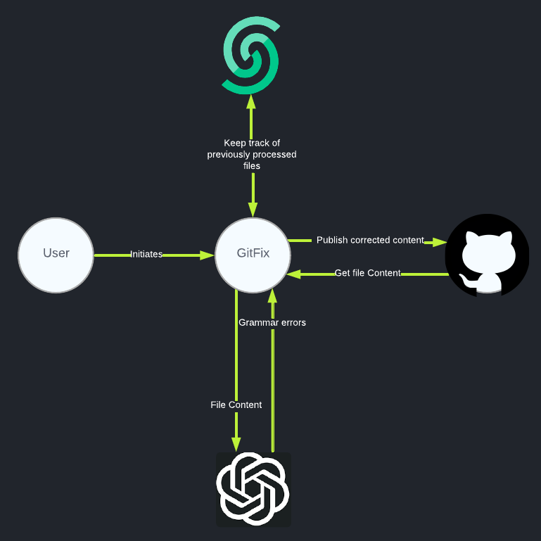

# GitFix

GitFix is a grammar correction application that uses GPT4 to correct grammatical errors in md and mdx files in GitHub repositories with a single click.

> [!NOTE]  
> **This project is a Community Project.**
>
> The project is maintained and supported by the community. Upstash may contribute but does not officially support or assume responsibility for it.

### Tech Stack

- Backend: **Python 3.10** or **NodeJS 22**
- AI Integration: **OpenAI API**
- Data Storage: **[Upstash Redis](https://upstash.com/docs/redis/overall/getstarted)**
- Deployment Options: **[Vercel](https://vercel.com)** or **[Fly.io](https://fly.io)**

For the Python implementation, check out the gitfix-python folder under this repository.

## How to Use
To use GitFix, you can simply run `npm i` and create a config.json file in the root folder. 
Afterward, you can start your own GitFix server via `npm run dev`.
Then, using `node gitfix_client.js` will fix the grammatical errors in the target repository given in the config.json.

### Requirements:

- NodeJS 22
- Having a public repository
- An Upstash Redis database
- OpenAI API key
- GitHub API token with write permissions

### Contents of the config.json file

- github-repo: Target repository which GitFix will search for grammatical errors.

- files-per-run: Number of files GitFix will change at each run 

- github-token: A classic GitHub token with repo:status, public_repo, and write:packages rights.

- upstash-redis-url: URL to the Redis database

- upstash-redis-token: Token or password for the Redis database

- redis-password: Set this to true if you are using a password for DB authentication, false otherwise.

- openai-key: OpenAI API key

You can see an example config file in config.json in this repository.

### Indexing Your Repository

For GitFix to be able to discover your repository, it should be indexed in the GitHub Search Engine. 

You can check if it is indexed by performing a search on your GitHub homepage in the following format:

```
repo:[your repo name]  path:*.md
```

If the search results in your .md files, your repo is ready to go. Otherwise, you should wait until your repo is indexed. This process should take 2-3 minutes.

### Ready to go

After those steps, you can run GitFix.py, and GitFix will look for grammatical errors and will correct them automatically. 

Afterward, you will receive the corrected content in a PR request to your repository.

### How It Works



- GitFix uses GitHub API to fetch md and mdx files and passes these files to GPT4.

- GPT4 identifies the grammatical errors and suggests corrections.

- GitFix forks the repository and pushes the corrections. If the target repository is owned by the GitHub key owner, changes are pushed to a separate branch.

- Finally, a PR request is sent to the target repository.

### Deploy It Yourself

You can directly create a Vercel Project for free! For more, see [deploying GitHub repositories with Vercel](https://vercel.com/docs/deployments/git).
In your repository, you should provide the contents of the config.json file as environment variables.
The following provides a matching between config.json content and required environment variables.

```
GITFIX_USE_ENV=true => to instruct GitFix to read environment variables instead of config.json. The existence of a config.json file is still required to compile TypeScript.
"files-per-run" => FILES_PER_RUN
"github-token" => GITHUB_TOKEN
"upstash-redis-url" => process.env.UPSTASH_REDIS_URL
"upstash-redis-token" => process.env.UPSTASH_REDIS_TOKEN
"openai-key" => OPENAI_KEY
```

### Contributing

GitFix is a work in progress, so we'll add more features and improve the current ones. We've collected a few ideas we believe would make GitFix an even more helpful companion:

---

###### Optimize GPT4 Interaction:

Currently, all of the file context is consumed in one message. We would like to have GPT consume file content in multiple prompts as the time complexity of transformers scales with O(n^3).

In the future, we would like to partition the file content into contextually coherent sections and have GPT perform corrections on one section at a time.

---

###### Enable Unindexed and Private Repositories:

Our current interaction scheme with the GitHub API requires the target repo to be a public repository that is indexed in the GitHub Search Engine. 

This may cause problems for small repos as the search engine sometimes fails to index them.

If possible, we would like to remove the GitHub search API from our pipeline.


---

If one of these ideas sounds like something you'd like to work on, contributions are very welcome! You can contribute by adding new features, fixing bugs, improving documentation, writing blog posts, or by sharing GitFix on social media.
